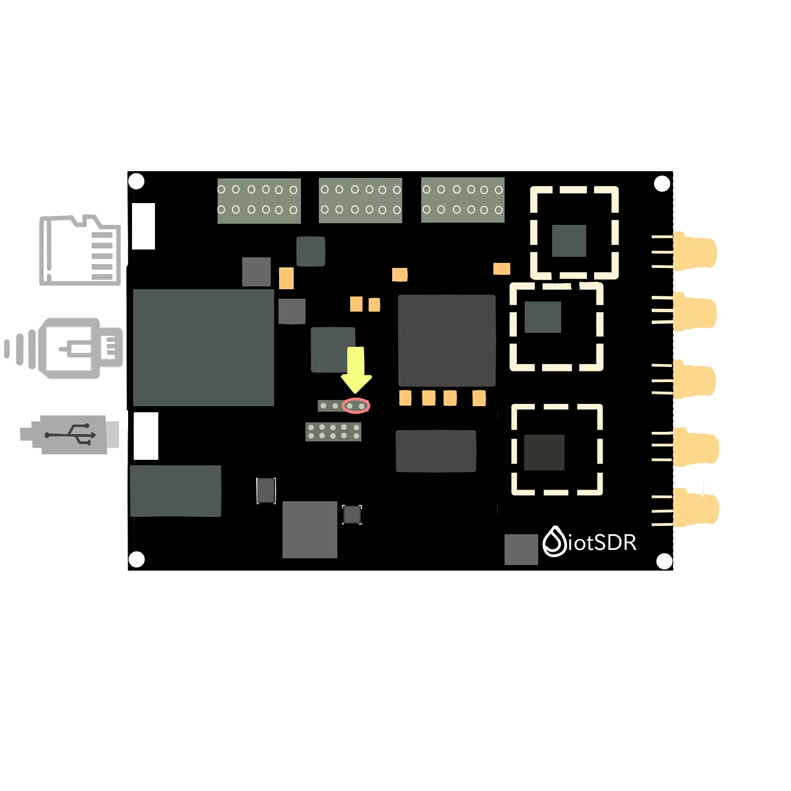
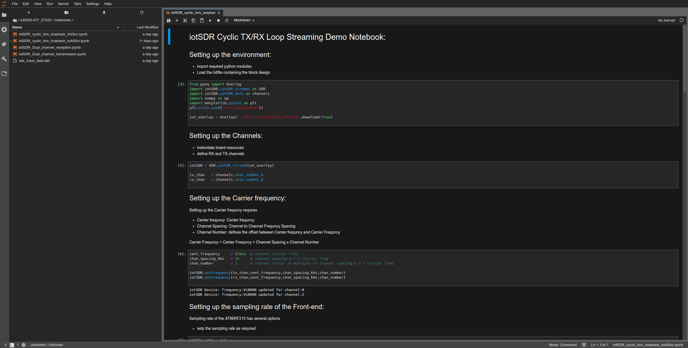

# iotSDR Getting Started Guide
------------------------------

This small guide will help you setup your board to get started with the jupyter notebook

## Pre-requisites
-----------------
        1. iotSDR-7010 or 7020 board
        2. Computer with compatible browser (Google Chrome)
        3. Ethernet cable  (100M or 1G)
        4. Micro USB data cable OR Power Adapter of 5V for Power Jack
        5. Micro-SD card(class 10) with preloaded image (16GB recommended)

## MicroSD Card Setup
---------------------

To flash iotSDR Micro-SD card follow the below steps:

  1. Download the appropriate iotSDR image for your board
  2. Click here for [iotSDR7010](https://drive.google.com/file/d/1KvhfKxierGDetbQY9Esg8TNZ2M34TprH/view?usp=sharing) or [iotSDR7020](https://bit.ly/3cxjA33)
  4. Use Etcher Utility [Etcher](https://www.balena.io/etcher/)
  5. following the Etcher instructions Write the image to a blank Micro SD card (16GB recommended)
   
if you are facing issues you can find the detailed instructions [here](https://github.com/embedinn/iotSDR/blob/master/iotSDR_uSD_Card.md)

## Board Setup
--------------
 

Set the ** Boot** jumper to the SD position. (This sets the board to boot Linux from the Micro-SD card)

        Insert the Micro SD card with respective pre-loaded iotSDR image file into the Micro SD card slot 
        Connect the  Ethernet cable, one end with iotSDR and other with PC
        Connect the USB cable to your PC/Laptop, and to the PWR + UART MicroUSB port 
        on the board (next to power jack)   
        iotSDR Board should now power up and get into boot sequence

## Running Jupyter On the iotSDR
--------------------------------

1. After setting the SD card header position, inserting the SD card with pre-loaded image file, and the USB cable is connected, the green LED will come on immediately to confirm that the board has power. Following to that, after few seconds, the Blue / Done LED should light up to show that bit file is loaded in the Zynq® device. After some time The Linux OS will be booted and ready for use.

2. Once board setup up is complete, you can connect your browser to it to start using Jupyter notebook. 

3. Follow the below procedure to configure ethernet connection between Host PC and iotSDR before running Jupyter notebook on browser

        1. Assign your computer a static IP address from the pool of 192.168.2.xx (except .99 and .1)
        2. Connect the board to your computer’s Ethernet port 
        3. ping to 192.168.2.99 to confirm that you are connected
        4. Now open chrome browser and write http://192.168.2.99:9090/lab in the search bar
        5. Enter password window will appear The password is: xilinx

Note: By default The board currently have a fixed IP (192.168.2.99) address mode.

## Running Application on Jupyter Notebook
------------------------------------------
After the password tab window, two folder of the notebooks on the left of webpage will appear and the files can be accessed and user can run the demo projects.

## Contact Us
-------------
if you are facing any issues, feel free to contact us at info@embedinn.com or at Discord https://discord.gg/kzxS8gsv7D
